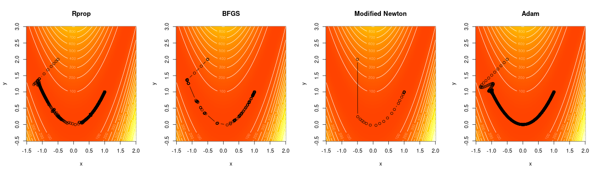

## Documentation

Autodiff is a numerical optimization and linear algebra library for the Go / Golang programming language. It implements basic automatic differentation for many mathematical routines. The documentation of this package can be found [here](https://godoc.org/github.com/pbenner/autodiff).

## Scalars

Autodiff has two different scalar types. The *Real* type allows to store first and second derivatives for the current value, whereas the *BareReal* type is a simple *float64* which cannot store any information other than its value. Every scalar supports the following set of functions:

| Function | Description                      |
| -------- | -------------------------------- |
| Min      | Minimum                          |
| Max      | Maximum                          |
| Abs      | Absolute value                   |
| Sign     | Sign                             |
| Neg      | Negation                         |
| Add      | Addition                         |
| Sub      | Substraction                     |
| Mul      | Multiplication                   |
| Div      | Division                         |
| Pow      | Power                            |
| Sqrt     | Square root                      |
| Exp      | Exponential function             |
| Log      | Logarithm                        |
| Log1p    | Logarithm of 1+x                 |
| Erf      | Error function                   |
| Erfc     | Complementary error function     |
| LogErfc  | Log complementary error function |
| Sin      | Sine                             |
| Sinh     | Hyperbolic sine                  |
| Cos      | Cosine                           |
| Cosh     | Hyperbolic cosine                |
| Tan      | Tangent                          |
| Tanh     | Hyperbolic tangent               |
| LogAdd   | Addition on log scale            |
| LogSub   | Substraction on log scale        |
| Gamma    | Gamma function                   |
| Lgamma   | Log gamma function               |
| Mlgamma  | Multivariate log gamma function  |
| GammaP   | Lower incomplete gamma function  |

## Vectors and Matrices

Autodiff supports vectors and matrices including basic linear algebra operations. Vectors support the following linear algebra operations:

| Function | Description                      |
| -------- | -------------------------------- |
| VaddV    | Element-wise addition            |
| VsubV    | Element-wise substraction        |
| VmulV    | Element-wise multiplication      |
| VdivV    | Element-wise division            |
| VaddS    | Addition of a scalar             |
| VsubS    | Substraction of a scalar         |
| VmulS    | Multiplication with a scalar     |
| VdivS    | Division by a scalar             |
| VdotV    | Dot product                      |

Matrices support the following linear algebra operations:

| Function | Description                      |
| -------- | -------------------------------- |
| MaddM    | Element-wise addition            |
| MsubM    | Element-wise substraction        |
| MmulM    | Element-wise multiplication      |
| MdivM    | Element-wise division            |
| MaddS    | Addition of a scalar             |
| MsubS    | Substraction of a scalar         |
| MmulS    | Multiplication with a scalar     |
| MdivS    | Division by a scalar             |
| MdotM    | Matrix product                   |
| Outer    | Outer product                    |

## Algorithms

The algorithms package contains more complex linear algebra and optimization routines:

| Package             | Description                                             |
| ------------------- | ------------------------------------------------------- |
| bfgs                | Broyden-Fletcher-Goldfarb-Shanno (BFGS) algorithm       |
| blahut              | Blahut algorithm (channel capacity)                     |
| cholesky            | Cholesky and LDL factorization                          |
| determinant         | Matrix determinants                                     |
| gaussJordan         | Gauss-Jordan algorithm                                  |
| gradientDescent     | Vanilla gradient desent algorithm                       |
| gramSchmidt         | Gram-Schmidt algorithm                                  |
| hessenbergReduction | Matrix Hessenberg reduction                             |
| lineSearch          | Line-search (satisfying the Wolfe conditions)           |
| matrixInverse       | Matrix inverse                                          |
| msqrt               | Matrix square root                                      |
| msqrtInv            | Inverse matrix square root                              |
| newton              | Newton's method (root finding and optimization)         |
| qrAlgorithm         | QR-Algorithm for computing eigenvalues and eigenvectors |
| rprop               | Resilient backpropagation                               |

## Basic usage

Import the autodiff library with
```go
  import . "github.com/pbenner/autodiff"
```
A scalar holding the value *1.0* can be defined in several ways, i.e.
```go
  a := NewScalar(RealType, 1.0)
  b := NewReal(1.0)
  c := NewBareReal(1.0)
```
*a* and *b* are both *Real*s, however *a* has type *Scalar* whereas *b* has type **Real* which implements a *Scalar*. Variable *c* is of type **BareReal* which cannot carry any derivatives. We may add two variables with
```go
  d := Add(a, b)
```
where the result is stored in a new variable called *d*. In general, it is more efficient to use
```go
  a.Add(a, b)
```
which stores the result in *a* instead of allocating a new variable. To differentiate a function
```go
  f := func(x, y Scalar) Scalar {
    return Add(Mul(x, Pow(y, NewReal(3))), NewReal(4))
  }
```
we first define two reals
```go
  x := NewReal(2)
  y := NewReal(4)
```
that store the value at which the derivative of *f* should be evaluated. Afterwards, *x* and *y* must be defined as variables with
```go
  Variables(2, x, y)
```
where the first argument means that derivatives up to second order should be computed. After evaluating *f*, i.e.
```go
  z := f(x, y)
```
the function value at *(x,y) = (2, 4)* can be retrieved with *z.GetValue()*. The first and second partial derivatives can be accessed with *z.GetDerivative(i)* and *z.GetHessian(i, j)*, where the arguments specify the index of the variable. For instance, the derivative of *f* with respect to *x* is returned by *z.GetDerivative(0)*, whereas the derivative with respect to *y* by *z.GetDerivative(1)*.

## Basic linear algebra

Vectors and matrices can be created with
```go
  v := NewVector(RealType, []float64{1,2})
  m := NewMatrix(RealType, 2, 2, []float64{1,2,3,4})
```
where *v* has length 2 and *m* is a 2x2 matrix. With
```go
  v := NullVector(RealType, 2)
  m := NullMatrix(RealType, 2, 2)
```
all values are initially set to zero. Vector and matrix elements can be accessed with the *At* method, which returns a reference to the Scalar, i.e.
```go
  m.At(1,1).Add(v.At(0), v.At(1))
```
adds the first two values in *v* and stores the result in the lower right element of the matrix *m*. Autodiff supports basic linear algebra operations, for instance, the vector matrix product can be computed with
```go
  w := NullVector(RealType, 2)
  w.MdotV(m, v)
```
where the result is stored in w. Other operations, such as computing the eigenvalues and eigenvectors of a matrix, require importing the respective package from the algorithm library, i.e.
```go
  import "github.com/pbenner/autodiff/algorithm/qrAlgorithm"

  lambda := qrAlgorithm.Eigenvalues(m)
```

## Examples

### Gradient descent

Compare vanilla gradient descent with resilient backpropagation
```go
  import . "github.com/pbenner/autodiff"
  import   "github.com/pbenner/autodiff/algorithm/gradientDescent"
  import   "github.com/pbenner/autodiff/algorithm/rprop"
  import . "github.com/pbenner/autodiff/simple"

  f := func(x Vector) Scalar {
    // x^4 - 3x^3 + 2
    return Add(Sub(Pow(x.At(0), NewReal(4)), Mul(NewReal(3), Pow(x.At(0), NewReal(3)))), NewReal(2))
  }
  x0 := NewVector(RealType, []float64{8})
  // vanilla gradient descent
  xn1, _ := gradientDescent.Run(f, x0, 0.0001, gradientDescent.Epsilon{1e-8})
  // resilient backpropagation
  xn2, _ := rprop.Run(f, x0, 0.0001, 0.4, rprop.Epsilon{1e-8})
```


### Matrix inversion

Compute the inverse *r* of a matrix *m* by minimizing the Frobenius norm *||mb - I||*
```go
  import . "github.com/pbenner/autodiff"
  import   "github.com/pbenner/autodiff/algorithm/rprop"
  import . "github.com/pbenner/autodiff/simple"

  m := NewMatrix(RealType, 2, 2, []float64{1,2,3,4})

  I := IdentityMatrix(RealType, 2)
  r := m.Clone()
  // objective function
  f := func(x Vector) Scalar {
    r.SetValues(x)
    s := Mnorm(MsubM(MmulM(m, r), I))
    return s
  }
  x, _ := rprop.Run(f, r.GetValues(), 0.01, 0.1, rprop.Epsilon{1e-12})
  r.SetValues(x)
```

### Newton's method

Find the root of a function *f* with initial value *x0 = (1,1)*

```go
  import . "github.com/pbenner/autodiff"
  import   "github.com/pbenner/autodiff/algorithm/newton"
  import . "github.com/pbenner/autodiff/simple"

  f := func(x Vector) Vector {
    y := NilDenseVector(2)
    // y1 = x1^2 + x2^2 - 6
    // y2 = x1^3 - x2^2
    y[0] = Sub(Add(Pow(x.At(0), NewReal(2)), Pow(x.At(1), NewReal(2))), NewReal(6))
    y[1] = Sub(Pow(x.At(0), NewReal(3)), Pow(x.At(1), NewReal(2)))

    return y
  }

  x0    := NewVector(RealType, []float64{1,1})
  xn, _ := newton.RunRoot(f, x0, newton.Epsilon{1e-8})
```

### Minimize Rosenbrock's function
Compare Newton's method, BFGS and Rprop for minimizing Rosenbrock's function

```go
  import . "github.com/pbenner/autodiff"
  import   "github.com/pbenner/autodiff/algorithm/rprop"
  import   "github.com/pbenner/autodiff/algorithm/bfgs"
  import   "github.com/pbenner/autodiff/algorithm/newton"
  import . "github.com/pbenner/autodiff/simple"

  f := func(x Vector) (Scalar, error) {
     // f(x1, x2) = (a - x1)^2 + b(x2 - x1^2)^2
     // a = 1
     // b = 100
     // minimum: (x1,x2) = (a, a^2)
     a := NewReal(  1.0)
     b := NewReal(100.0)
     s := Pow(Sub(a, x.At(0)), NewReal(2.0))
     t := Mul(b, Pow(Sub(x.At(1), Mul(x.At(0), x.At(0))), NewReal(2.0)))
     return Add(s, t), nil
   }
  hook_bfgs := func(x, gradient Vector, y Scalar) bool {
    fmt.Println("x       :", x)
    fmt.Println("gradient:", gradient)
    fmt.Println("y       :", y)
    fmt.Println()
    return false
  }
  hook_rprop := func(gradient, step []float64, x Vector, y Scalar) bool {
    fmt.Println("x       :", x)
    fmt.Println("gradient:", gradient)
    fmt.Println("y       :", y)
    fmt.Println()
    return false
  }
  hook_newton := func(x, gradient Vector, hessian Matrix, y Scalar) bool {
    fmt.Println("x       :", x)
    fmt.Println("gradient:", gradient)
    fmt.Println("y       :", y)
    fmt.Println()
    return false
  }

  x0 := NewVector(RealType, []float64{-0.5, 2})

  rprop.Run(f, x0, 0.05, []float64{1.2, 0.8},
    rprop.Hook{hook_rprop},
    rprop.Epsilon{1e-10})

  bfgs.Run(f, x0,
    bfgs.Hook{hook_bfgs},
    bfgs.Epsilon{1e-10})

  newton.RunMin(f, x0,
    newton.HookMin{hook_newton},
    newton.Epsilon{1e-8},
    newton.HessianModification{"LDL"})
```


### Constrained optimization

Maximize the function *f(x, y) = x + y* subject to *x^2 + y^2 = 1* by finding the critical point of the corresponding Lagrangian

```go
  import . "github.com/pbenner/autodiff"
  import   "github.com/pbenner/autodiff/algorithm/newton"
  import . "github.com/pbenner/autodiff/simple"

  // define the Lagrangian
  f := func(x Vector) (Scalar, error) {
    // x + y + lambda(x^2 + y^2 - 1)
    y := Add(Add(x.At(0), x.At(1)), Mul(x.At(2), Sub(Add(Mul(x.At(0), x.At(0)), Mul(x.At(1), x.At(1))), NewReal(1))))

    return y, nil
  }
  // initial value
  x0    := NewVector(RealType, []float64{3,  5, 1})
  // run Newton's method
  xn, _ := newton.RunCrit(
      f, x0,
      newton.Epsilon{1e-8})
```
