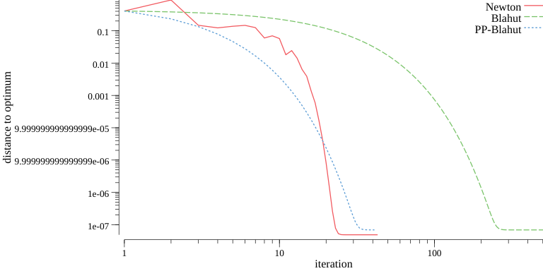

Find the capacity of a channel between *X* and *Y* by maximizing the mutual information
$$
  I_{\pi}(X;Y)
  =
  \sum_{x,y}
  p(x,y)
  \log
  \frac{p(x,y)}{p(x)p(y)}
  \ , \ 
  \text{where}
  \ 
  p(x,y) = p(y|x)\pi(x)
  \ .
$$

The gradient based approache uses Newton's method to find a critical point of the Lagrangian
$$
  \mathcal{L}(\theta, \lambda)
  =
  I_{\pi=\exp(\theta)}(X;Y)
  +
  \lambda
  \left(
    \sum_x \exp(\theta_x) - 1
  \right)
  \ ,
$$
where probabilities are represented on log-scale.

