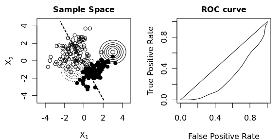

Maximize the ROC curve of quadratic discriminant analysis. The objective function is:

where TPR denotes the true positive rate and FPR the false positive rate of the classifier, both as a function of the threshold t. The parameters of the quadratic discriminant analysis given by the vector 

, which includes the means and covariance matrices of both normal distributions. Gradient ascent is used to maximize f with respect to x.

