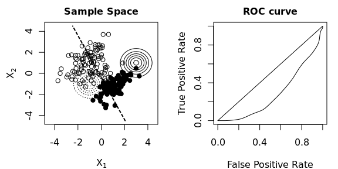

Maximize the ROC curve of quadratic discriminant analysis. The objective function is:
$$
f(\theta)
=
\int_t
TPR_\theta(t) \mathrm{d} FPR_\theta(t)
$$
where $TPR$ denotes the true positive rate and FPR the false positive rate of the classifier. The parameters of the quadratic discriminant analysis is denoted by $\theta$ and includes the means and covariance matrices of both normal distributions. Gradient ascent is used to maximize $f$ with respect to $\theta$.

